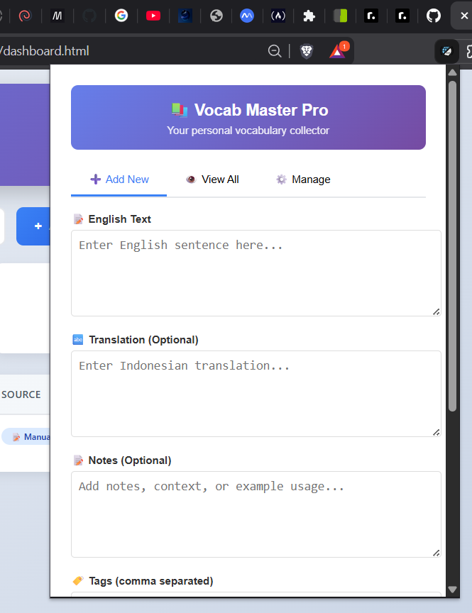
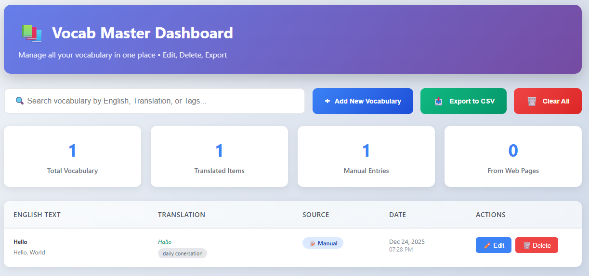
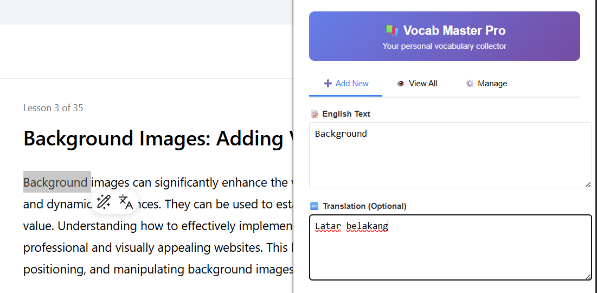
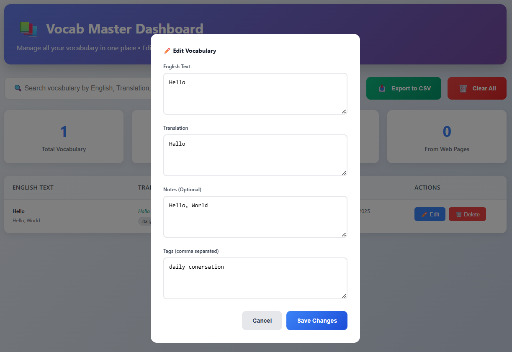

# 📚 Vocab Master - Chrome Extension

<div align="center">
  
  
  
  
  

  

**Capture, Save, and Master English Vocabulary Effortlessly**

[Features](#-features) • [Installation](#-installation) • [Usage](#-usage) • [Screenshots](#-screenshots) • [Development](#-development)

</div>

## 🌟 Overview

**Vocab Master** is a powerful Chrome extension designed for English language learners and enthusiasts. It helps you capture English sentences from any website, automatically translate them to Indonesian (or your preferred language), and organize them in a beautiful, searchable vocabulary database.

Never lose an important sentence again! Whether you're reading articles, watching videos, or browsing social media, Vocab Master lets you build your personal vocabulary collection with just one click.

## ✨ Features

### 🎯 Core Features

- **📝 Text Capture**: Select any English text on any webpage and save it instantly
- **🌐 Auto-Translation**: Automatic translation to Indonesian using Google Translate API
- **📊 Vocabulary Dashboard**: Beautiful dashboard to manage all your saved vocabulary
- **🔍 Smart Search**: Search through your vocabulary by English text, translation, or tags
- **📥 Export Data**: Export your vocabulary to CSV for backup or use in other apps
- **🏷️ Tag System**: Organize vocabulary with custom tags for easy categorization

### 🛠️ Advanced Features

- **✏️ Edit & Delete**: Full CRUD operations for your vocabulary items
- **📈 Statistics Dashboard**: View detailed statistics about your learning progress
- **🔄 Context Menu**: Right-click on any selected text to save instantly
- **📱 Responsive Design**: Works perfectly on all screen sizes
- **🎨 Beautiful UI**: Modern, intuitive interface with smooth animations

## 🚀 Installation

### Method 1: Install from Chrome Web Store (Coming Soon)

_(Pending publication)_

### Method 2: Install Manually (Developer Mode)

1. **Download the Extension**

   ```bash
   # Clone the repository or download ZIP
   git clone https://github.com/arrizarisky/Vocabulary-master-extension.git
   ```

2. **Load in Chrome**

   - Open Chrome and go to `chrome://extensions/`
   - Enable **"Developer mode"** (toggle in top-right corner)
   - Click **"Load unpacked"**
   - Select the folder containing the extension files

3. **Verify Installation**
   - You should see the Vocab Master icon in your Chrome toolbar
   - Click the icon to open the popup interface

### Folder Structure

```
vocab-master/
├── manifest.json           # Extension configuration
├── popup.html             # Main popup interface
├── popup.js              # Popup logic
├── dashboard.html        # Full dashboard page
├── dashboard.js         # Dashboard logic
├── background.js        # Background service worker
└── icons/               # Extension icons
    ├── icon16.png
    ├── icon48.png
    └── icon128.png
```

## 📖 How to Use

### Basic Usage - Saving Vocabulary

#### Method 1: Text Selection (Easiest!)

1. **Select text** on any webpage
2. **Click the floating button** that appears near your selection
3. **Click "Save"** - the text is saved with auto-translation!


#### Method 2: Right-Click Context Menu

1. **Select text** on any webpage
2. **Right-click** and choose **"Save to Vocab Master"**
3. The vocabulary is saved automatically!

#### Method 3: Manual Entry

1. **Click the extension icon** in Chrome toolbar
2. **Switch to "Add New" tab**
3. **Enter English text** and translation
4. **Add notes and tags** (optional)
5. **Click "Save Vocabulary"**

### Managing Your Vocabulary

#### View All Vocabulary

1. Click extension icon
2. Switch to **"View All" tab**
3. Browse through all your saved vocabulary
4. Use the search bar to find specific items

#### Edit Vocabulary

1. Go to the Dashboard (`dashboard.html`)
2. Click **"✏️ Edit"** button on any item
3. Modify the text, translation, notes, or tags
4. Click **"Save Changes"**

#### Delete Vocabulary

1. Go to the Dashboard or popup
2. Click **"🗑️ Delete"** button on any item
3. Confirm the deletion

#### Export Your Data

1. Open the Dashboard or popup
2. Click **"Export to CSV"**
3. A CSV file will download automatically
4. Open in Excel, Google Sheets, or any spreadsheet app

### Dashboard Features

The full dashboard (`dashboard.html`) provides advanced features:

- **📊 Statistics**: View total vocabulary count, translated items, and sources
- **🔍 Advanced Search**: Search across all fields including notes and tags
- **📈 Progress Tracking**: See your learning progress over time
- **⚙️ Bulk Operations**: Clear all data or export everything at once

## 🖼️ Screenshots

### Popup Interface



### Dashboard



### Text Selection



### Edit Modal



## 🔧 Development

### Prerequisites

- Google Chrome browser
- Basic knowledge of HTML, CSS, and JavaScript

### Building from Source

1. **Clone the repository**

   ```bash
   git clone https://github.com/arrizarisky/Vocabulary-master-extension.git
   cd vocab-master
   ```

2. **Make changes**

   - Edit files as needed
   - Test locally by reloading the extension

3. **Load in Chrome**
   - Go to `chrome://extensions/`
   - Click refresh icon on Vocab Master card
   - Or click "Load unpacked" and select the folder again

### File Structure Explained

- **`manifest.json`**: Extension configuration and permissions
- **`popup.html/js`**: Main popup interface that appears when clicking extension icon
- **`dashboard.html/js`**: Full-page dashboard for advanced management
- **`background.js`**: Background service worker for context menu and storage
- **`content.js`**: Content script injected into webpages for text selection

### API Keys (Optional)

For translation functionality, the extension uses Google Translate API. No API key is needed for basic usage, but you can add your own for higher limits:

1. Get API key from [Google Cloud Console](https://console.cloud.google.com/)
2. Add to `background.js` in the translation function

## 🤝 Contributing

We welcome contributions! Here's how you can help:

1. **Fork the repository**
2. **Create a feature branch**
   ```bash
   git checkout -b feature/amazing-feature
   ```
3. **Commit your changes**
   ```bash
   git commit -m 'Add some amazing feature'
   ```
4. **Push to the branch**
   ```bash
   git push origin feature/amazing-feature
   ```
5. **Open a Pull Request**

### Areas for Improvement

- [ ] Add support for more languages
- [ ] Implement spaced repetition system (SRS)
- [ ] Add cloud sync functionality
- [ ] Create mobile companion app
- [ ] Add pronunciation (text-to-speech)
- [ ] Implement vocabulary quizzes

## 📄 License

This project is licensed by me

## 🙏 Acknowledgments

- **Google Translate API** for translation services
- **Chrome Extension API** for making this possible
- **All contributors** who help improve this extension
- **English learners** worldwide - keep learning!

## 🐛 Troubleshooting

### Common Issues

#### Extension not showing up

- Make sure Developer Mode is enabled in `chrome://extensions/`
- Try removing and re-adding the extension
- Restart Chrome browser

#### Text selection not working

- Ensure the extension has proper permissions
- Try on a different website
- Check if any other extensions are interfering

#### Translation not working

- Check your internet connection
- Google Translate API might be temporarily unavailable
- Try saving without translation and edit later

#### Data not saving

- Check Chrome storage is not full
- Try exporting your data as backup
- Clear extension data and start fresh

### Getting Help

1. **Check the [Issues](https://github.com/arrizarisky/Vocabulary-master-extension/issues)** page
2. **Create a new issue** if your problem isn't listed
3. **Include details**: Chrome version, OS, steps to reproduce

## 📞 Support

- **GitHub Issues**: [Report a bug or request a feature](https://github.com/arrizarisky/Vocabulary-master-extension/issues)
- **Email**: support@vocabmaster.com
- **Documentation**: [Full documentation](https://docs.vocabmaster.com)

---

<div align="center">

### Made with ❤️ for English learners everywhere

⭐ **Star this project** if you find it useful!

[⬆ Back to Top](#-vocab-master---chrome-extension)

</div>

## 📱 Stay Updated

- **GitHub**: [https://github.com/arrizarisky/Vocabulary-master-extension](https://github.com/yourusername/vocab-master)
- **Twitter**: [@VocabMasterApp](https://twitter.com/VocabMasterApp) Coming Soon
- **Website**: [vocabmaster.com](https://vocabmaster.com) Coming Soon

---

**Happy Learning!** 🎓✨
